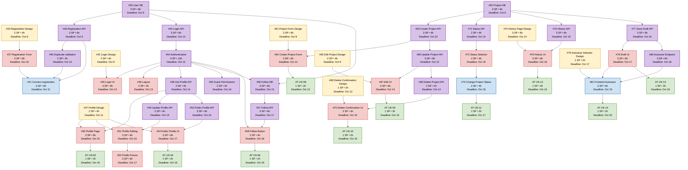

```mermaid
graph TD

    %% =========================
    %% AUTHENTICATION
    %% =========================

    A["#35 User DB<br/>3 SP • 6h<br/>Deadline: Oct 8"]
    E["#34 Registration Design<br/>2 SP • 4h<br/>Deadline: Oct 8"]

    A --> B["#36 Registration API<br/>3 SP • 6h<br/>Deadline: Oct 9"]
    B --> C["#40 Duplicate validation<br/>2 SP • 4h<br/>Deadline: Oct 10"]
    B --> D["#41 Connect registration<br/>3 SP • 6h<br/>Deadline: Oct 11"]
    E --> F["#37 Registration Form<br/>3 SP • 6h<br/>Deadline: Oct 10"]
    F --> D
    C --> D

    A --> G["#43 Login API<br/>3 SP • 6h<br/>Deadline: Oct 10"]
    G --> H["#44 Authentication<br/>5 SP • 10h<br/>Deadline: Oct 12"]

    I["#42 Login Design<br/>2 SP • 4h<br/>Deadline: Oct 9"]
    I --> J["#45 Login UI<br/>3 SP • 6h<br/>Deadline: Oct 13"]
    H --> J
    H --> K["#46 Logout<br/>2 SP • 4h<br/>Deadline: Oct 13"]

    H --> L["#48 Get Profile API<br/>2 SP • 4h<br/>Deadline: Oct 14"]

    M["#47 Profile Design<br/>2 SP • 4h<br/>Deadline: Oct 11"]
    L --> N["#50 Profile Page<br/>3 SP • 6h<br/>Deadline: Oct 15"]
    M --> N

    L --> O["#49 Update Profile API<br/>2 SP • 4h<br/>Deadline: Oct 15"]
    O --> P["#51 Profile Editing<br/>3 SP • 6h<br/>Deadline: Oct 16"]
    M --> P
    P --> Q["#52 Profile Picture<br/>3 SP • 6h<br/>Deadline: Oct 17"]

    L --> R["#53 Public Profile API<br/>3 SP • 6h<br/>Deadline: Oct 16"]
    R --> S["#54 Public Profile UI<br/>3 SP • 6h<br/>Deadline: Oct 17"]
    M --> S

    H --> T["#55 Guest Permissions<br/>2 SP • 4h<br/>Deadline: Oct 16"]

    A --> U["#56 Follow DB<br/>3 SP • 6h<br/>Deadline: Oct 15"]
    H --> U
    U --> V["#57 Follow API<br/>3 SP • 6h<br/>Deadline: Oct 17"]
    V --> W["#58 Follow Button<br/>2 SP • 4h<br/>Deadline: Oct 18"]
    H --> W

    N --> AT3["AT US-03<br/>1 SP • 2h<br/>Deadline: Oct 16"]
    S --> AT4["AT US-04<br/>1 SP • 2h<br/>Deadline: Oct 18"]
    W --> AT6["AT US-06<br/>1 SP • 2h<br/>Deadline: Oct 19"]


    %% =========================
    %% PROJECTS
    %% =========================

    X["#62 Project DB<br/>3 SP • 6h<br/>Deadline: Oct 8"]
    Y["#61 Project Form Design<br/>3 SP • 6h<br/>Deadline: Oct 8"]

    X --> Z["#63 Create Project API<br/>3 SP • 6h<br/>Deadline: Oct 10"]
    Z --> AA["#64 Create Project Form<br/>3 SP • 6h<br/>Deadline: Oct 12"]
    Y --> AA

    Z --> AB["#66 Update Project API<br/>3 SP • 6h<br/>Deadline: Oct 12"]

    AC["#65 Edit Project Design<br/>2 SP • 4h<br/>Deadline: Oct 9"]
    AC --> AD["#67 Edit UI<br/>3 SP • 6h<br/>Deadline: Oct 14"]
    AB --> AD

    AB --> AE["#69 Delete Project API<br/>2 SP • 4h<br/>Deadline: Oct 14"]

    AF["#68 Delete Confirmation Design<br/>1 SP • 2h<br/>Deadline: Oct 12"]
    AE --> AG["#70 Delete Confirmation UI<br/>2 SP • 4h<br/>Deadline: Oct 15"]
    AF --> AG

    X --> AH["#71 Status API<br/>2 SP • 4h<br/>Deadline: Oct 14"]
    AH --> AI["#72 Status Selector<br/>2 SP • 4h<br/>Deadline: Oct 15"]
    AI --> AJ["#73 Change Project Status<br/>2 SP • 4h<br/>Deadline: Oct 16"]

    X --> AK["#75 History API<br/>3 SP • 6h<br/>Deadline: Oct 16"]

    AL["#74 History Page Design<br/>3 SP • 6h<br/>Deadline: Oct 14"]
    AK --> AM["#76 History UI<br/>3 SP • 6h<br/>Deadline: Oct 18"]
    AL --> AM

    X --> AN["#77 Save Draft API<br/>3 SP • 6h<br/>Deadline: Oct 16"]
    AN --> AO["#78 Draft UI<br/>3 SP • 6h<br/>Deadline: Oct 17"]

    AN --> AP["#80 Autosave Endpoint<br/>3 SP • 6h<br/>Deadline: Oct 18"]

    AQ["#79 Autosave Indicator Design<br/>1 SP • 2h<br/>Deadline: Oct 17"]
    AQ --> AR["#81 Frontend Autosave<br/>3 SP • 6h<br/>Deadline: Oct 19"]
    AP --> AR
    AO --> AR

    AA --> AT8["AT US-08<br/>1 SP • 2h<br/>Deadline: Oct 13"]
    AD --> AT9["AT US-09<br/>1 SP • 2h<br/>Deadline: Oct 15"]
    AG --> AT10["AT US-10<br/>1 SP • 2h<br/>Deadline: Oct 16"]
    AJ --> AT11["AT US-11<br/>1 SP • 2h<br/>Deadline: Oct 17"]
    AM --> AT12["AT US-12<br/>1 SP • 2h<br/>Deadline: Oct 19"]
    AO --> AT13["AT US-13<br/>1 SP • 2h<br/>Deadline: Oct 18"]
    AR --> AT14["AT US-14<br/>1 SP • 2h<br/>Deadline: Oct 20"]


    %% =========================
    %% COLORS
    %% =========================

    classDef design fill:#fff2cc,stroke:#d6b656,stroke-width:2px,color:#000;
    classDef backend fill:#d9c2e9,stroke:#8e44ad,stroke-width:2px,color:#000;
    classDef frontend fill:#f4cccc,stroke:#e06666,stroke-width:2px,color:#000;
    classDef integration fill:#cfe2f3,stroke:#3d85c6,stroke-width:2px,color:#000;
    classDef acceptance fill:#d9ead3,stroke:#6aa84f,stroke-width:2px,color:#000;

    %% Design
    class E,I,M,Y,AC,AF,AL,AQ design;

    %% Backend
    class A,B,C,G,H,L,O,R,T,U,V,X,Z,AB,AE,AH,AK,AN,AP backend;

    %% Frontend
    class F,J,K,N,P,Q,S,W,AA,AD,AG,AI,AO,AM frontend;

    %% Integration
    class D,AR,AJ,AT3,AT4,AT6,AT8,AT9,AT10,AT11,AT12,AT13,AT14 integration;

    %% Acceptance Tests
    class AT3,AT4,AT6,AT8,AT9,AT10,AT11,AT12,AT13,AT14 acceptance;
```