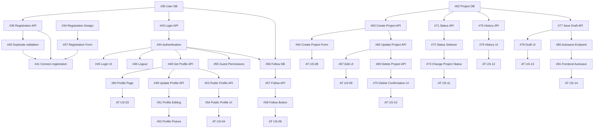

```mermaid
graph TD

    A[#35 User DB] --> B[#36 Registration API]
    B --> C[#40 Duplicate validation]
    B --> D[#41 Connect registration]
    E[#34 Registration Design] --> F[#37 Registration Form]
    F --> D
    C --> D

    A --> G[#43 Login API]
    G --> H[#44 Authentication]
    H --> I[#45 Login UI]
    H --> J[#46 Logout]

    H --> K[#48 Get Profile API]
    K --> L[#50 Profile Page]
    K --> M[#49 Update Profile API]
    M --> N[#51 Profile Editing]
    N --> O[#52 Profile Picture]

    K --> P[#53 Public Profile API]
    P --> Q[#54 Public Profile UI]

    H --> R[#55 Guest Permissions]

    A --> S[#56 Follow DB]
    H --> S
    S --> T[#57 Follow API]
    T --> U[#58 Follow Button]

    V[#62 Project DB] --> W[#63 Create Project API]
    W --> X[#64 Create Project Form]

    W --> Y[#66 Update Project API]
    Y --> Z[#67 Edit UI]

    Y --> AA[#69 Delete Project API]
    AA --> AB[#70 Delete Confirmation UI]

    V --> AC[#71 Status API]
    AC --> AD[#72 Status Selector]
    AD --> AE[#73 Change Project Status]

    V --> AF[#75 History API]
    AF --> AG[#76 History UI]

    V --> AH[#77 Save Draft API]
    AH --> AI[#78 Draft UI]

    AH --> AJ[#80 Autosave Endpoint]
    AJ --> AK[#81 Frontend Autosave]

    L --> AL[AT US-03]
    Q --> AM[AT US-04]
    U --> AN[AT US-06]

    X --> AO[AT US-08]
    Z --> AP[AT US-09]
    AB --> AQ[AT US-10]
    AE --> AR[AT US-11]
    AG --> AS[AT US-12]
    AI --> AT[AT US-13]
    AK --> AU[AT US-14]
```